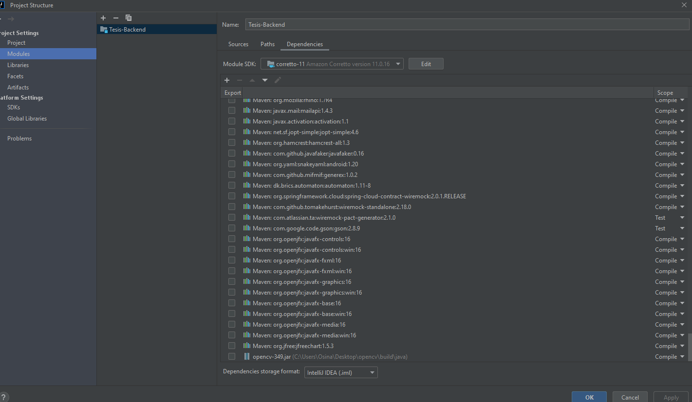
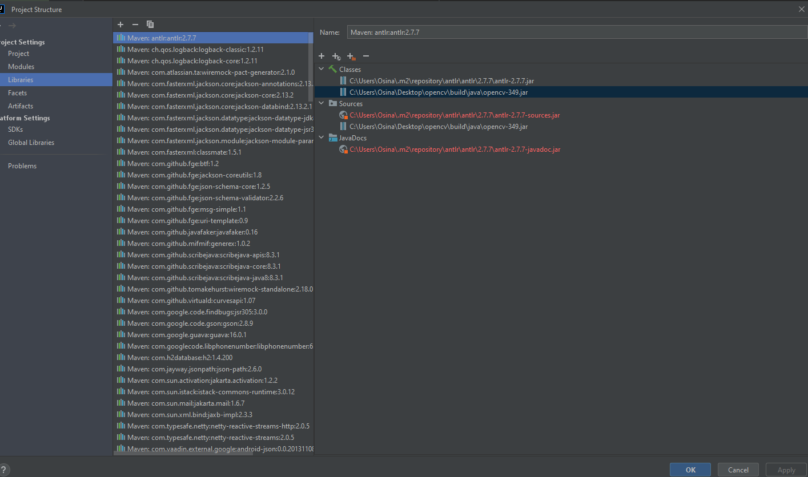
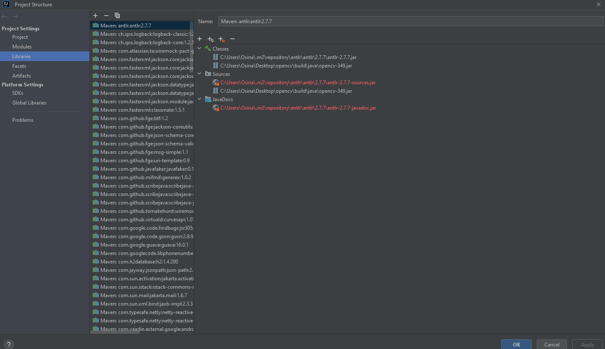

# Tesis-backend

## 👥 Contact

This service is currently supported by Lautaro Osinaga.

* Email: osinagalj@gmail.com

## Getting Started

1. Make sure you have:
    - PostgresSQL v.x
    - Make sure you are using JDK-11.0.9
      from [here](https://www.oracle.com/java/technologies/javase/jdk11-archive-downloads.html)  in project settings
2. Clone this project to your local directory
3. Open the project with Intellij
4. Use Spring Boot application configuration, and set options:
5. Run `mvn clean package`
6. You may now run/debug the service in IntelliJ
    1. Navigate to [localhost:8080](http://localhost:8080/) to view the UI

## Common Issues

`Click in the project -> Maven -> Reload project`

##### AB test overrides are not working

Make sure you have a valid java version.

[Sample Postman collection with domain requests](https://www.postman.com/collections/89f2152703290211f1c8)

## Docker

Assuming you have done AWS test account keygen and Vault login, and you are in project folder

```
vault login -no-print -tls-skip-verify -address=https://vault-enterprise.us-west-2.secrets.runtime.test-cts.exp-aws.net -namespace=lab -method=ldap username=${USER}
```

------------

## Release Process

Documentation:

Agregar OPENCV como librery externa




Solo agregand la libreria de opencv funciona: 

Cómo compilar OpenCV 3.4.9 en macOS con Java (generar .dylib)
Paso 1: Instalá herramientas básicas

Abre Terminal y ejecuta:

brew install cmake ant

cmake para compilar OpenCV.

ant para compilar el código Java.

Paso 2: Descargá el código fuente de OpenCV y opencv_contrib (opcional)
cd ~
git clone https://github.com/opencv/opencv.git
cd opencv
git checkout 3.4.9

Si querés módulos extra (recomendado):

cd ~
git clone https://github.com/opencv/opencv_contrib.git
cd opencv_contrib
git checkout 3.4.9

Paso 3: Crear carpeta build y configurar cmake para Java
cd ~/opencv
mkdir build
cd build

Ejecuta:

cmake -G "Unix Makefiles" \
-D CMAKE_BUILD_TYPE=Release \
-D CMAKE_INSTALL_PREFIX=/usr/local \
-D CMAKE_POLICY_VERSION_MINIMUM=3.5 \
-D BUILD_opencv_java=ON \
-D JAVA_HOME=/Users/lautaro.osinaga/Library/Java/JavaVirtualMachines/corretto-21.0.6/Contents/Home \
..

succes smessage:
-- Configuring done (69.9s)
-- Generating done (2.0s)
-- Build files have been written to: /Users/lautaro.osinaga/opencv/build

Si no descargaste opencv_contrib, sacá la línea:

-D OPENCV_EXTRA_MODULES_PATH=~/opencv_contrib/modules

Paso 4: Compilar OpenCV
make -j$(sysctl -n hw.logicalcpu)

Esto tarda varios minutos.

Paso 5: Instalar
sudo make install

Paso 6: Ubicar archivos generados

.jar Java: ~/opencv/build/bin/opencv-349.jar

.dylib nativa: ~/opencv/build/lib/libopencv_java349.dylib

Paso 7: Usar OpenCV en Java

En tu proyecto, agrega el .jar como dependencia (en IntelliJ o tu build system).

Ejecuta tu app Java agregando este parámetro para encontrar la librería nativa:

-Djava.library.path=/Users/tu_usuario/opencv/build/lib

En tu código Java, poné:

static {
System.loadLibrary(Core.NATIVE_LIBRARY_NAME);
}

Solo agregand la libreria de opencv funciona: 


Cómo compilar OpenCV 3.4.9 en macOS con Java (generar .dylib)
Paso 1: Instalá herramientas básicas

Abre Terminal y ejecuta:

brew install cmake ant

cmake para compilar OpenCV.

ant para compilar el código Java.

Paso 2: Descargá el código fuente de OpenCV y opencv_contrib (opcional)
cd ~
git clone https://github.com/opencv/opencv.git
cd opencv
git checkout 4.8.1

Si querés módulos extra (recomendado):

cd ~
git clone https://github.com/opencv/opencv_contrib.git
cd opencv_contrib
git checkout 4.8.1

Paso 3: Crear carpeta build y configurar cmake para Java
cd ~/opencv
mkdir build
cd build

Ejecuta:
echo $JAVA_HOME
para obtener la ruta de JAVA_HOME

cmake -G "Unix Makefiles" \
-D CMAKE_BUILD_TYPE=Release \
-D CMAKE_INSTALL_PREFIX=/usr/local \
-D CMAKE_POLICY_VERSION_MINIMUM=3.5 \
-D BUILD_opencv_java=ON \
-D JAVA_HOME=/Users/lautaroosinaga/Library/Java/JavaVirtualMachines/corretto-11.0.28/Contents/Home \
..

succes smessage:
-- Configuring done (22.6s)
-- Generating done (0.6s)
-- Build files have been written to: /Users/lautaroosinaga/opencv/build


Si no descargaste opencv_contrib, sacá la línea:

-D OPENCV_EXTRA_MODULES_PATH=~/opencv_contrib/modules

Paso 4: Compilar OpenCV
make -j$(sysctl -n hw.logicalcpu)

Esto tarda varios minutos.

Paso 5: Instalar
sudo make install

Paso 6: Ubicar archivos generados

.jar Java: ~/opencv/build/bin/opencv-349.jar

.dylib nativa: ~/opencv/build/lib/libopencv_java349.dylib

Paso 7: Usar OpenCV en Java

En tu proyecto, agrega el .jar como dependencia (en IntelliJ o tu build system).

Ejecuta tu app Java agregando este parámetro para encontrar la librería nativa:

-Djava.library.path=/Users/tu_usuario/opencv/build/lib

En tu código Java, poné:

static {
System.loadLibrary(Core.NATIVE_LIBRARY_NAME);
}

Ejemplo completo para correr desde consola:
java -Djava.library.path=/Users/lautaroosinaga/opencv/build/lib \
-cp .:/Users/lautaroosinaga/opencv/build/bin/opencv-349.jar \
tu.paquete.Main
Ejemplo completo para correr desde consola:
java -Djava.library.path=/Users/tu_usuario/opencv/build/lib \
-cp .:/Users/tu_usuario/opencv/build/bin/opencv-349.jar \
tu.paquete.Main
